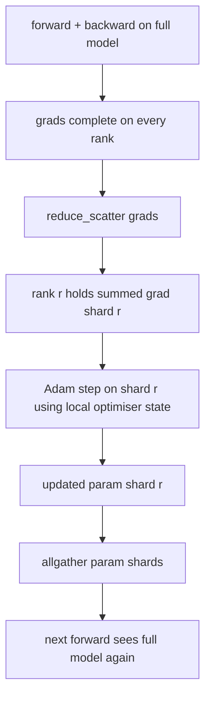

# ZeRO Optimizer状态分片

> Adam 为每个参数存储两个矩估计，均以 float32 形式存储。 7B 参数模型携带 56 GB 的Optimizer状态。 ZeRO 第一阶段分片跨越 N 个等级；每个等级拥有 1/N 的Optimizer。在本地步骤之后，更新的参数分片广播回来，每个等级重建完整的模型，然后开始下一步。胜利是训练堆栈中最大的单个分配的线性内存下降。

**Type:** Build
**Languages:** Python
**Prerequisites:** 第 19 期 Track C 课程 42-49
**Time:** ~90 分钟

## 学习目标

- N 个等级的碎片Optimizer状态（第一时刻、第二时刻、fp32 主副本），因此每个等级拥有 1/N。
- 使用reduce_scatter仅传递每个等级其分片的梯度和，然后allgather将更新的参数分片广播回来。
- 根据普通 DDP 计算阶段 1、阶段 2、阶段 3 的内存节省表。
- 在模型大小和带宽预算上捍卫第 1 阶段、第 2 阶段和第 3 阶段的选择。

## 问题

Vanilla DDP 复制了一切：参数、梯度和Optimizer状态在每个等级上都完整存在。对于 fp16 中的 7B 参数模型，这意味着每个等级 14 GB 参数、14 GB 梯度和 28 GB Optimizer状态。Optimizer状态是最大的术语，也是最容易分片的，因为它仅在步骤期间被触及，而不是在前进或后退期间被触及。

ZeRO 第 1 阶段对Optimizer状态进行分片。每个等级拥有 1/N 的 Adam 时刻。向后后，ZeRO 不会减少整个梯度并在本地步进，而是reduce_scatter，因此每个等级仅接收其分片的梯度总和。 Rank 将Optimizer步骤应用于其主参数的分片。更新后的参数碎片然后全部收集回来，以便每个等级都有下一个前进的完整模型。Optimizer内存下降 N。每步的线路流量与 DDP 相同：1 个 reduce_scatter 加 1 个 allgather 等于 1 个 allreduce 乘以带宽。内存获胜，吞吐量保持不变。

## 概念



### ZeRO 的阶段

|阶段|分片对象 |每 rank 内存|每 step 通信|
|-------|----------------|------------------|---------------|
| DDP |无 |params + grads + optim | 1x allreduce |
| ZeRO-1 |optimizer state |params + grads + optim/N | 1x reduce_scatter + 1x allgather |
| ZeRO-2 |optim + grads |params + grads/N + optim/N | 1x reduce_scatter + 1x allgather |
| ZeRO-3 |optim + grads + params |params/N + grads/N + optim/N |每层 1x allgather + 每层 1x reduce_scatter |

第一阶段是成本最低的胜利，因为优化状态主导了预算。第 2 阶段需要梯度分片累积逻辑，但带宽相同。第 3 阶段 (FSDP) 为每个前向和后向支付每层通信费用，从而获得参数分片内存下降。本课程完整实施第一阶段。

### 记忆数学，实数

对于使用 Adam 以混合精度训练的具有 P 参数的模型：

|术语 |vanilla|ZeRO-1 |为什么 |
|------|---------|--------|-----|
| fp16 参数 | 2P字节| 2P字节|需要转发|
| FP16 梯度 | 2P字节| 2P字节|需要落后|
| fp32 母版 | 4P字节| 4P/N 字节 |只有最优化的人才会使用它 |
| fp32 第一时刻 | 4P字节| 4P/N 字节 |只有最优化的人才会使用它 |
| fp32 第二时刻 | 4P字节| 4P/N 字节 |只有最优化的人才会使用它 |
|总计 | 16P字节| 4P + 12P/N 字节 |   |

N=8 时：vanilla 16P，ZeRO-1 5.5P，下降 65%。 N=64 时：vanilla 16P，ZeRO-1 4.19P，下降 74%。

### 为什么reduce_scatter 优于 allreduce-then-shard

Allreduce 为每个等级提供完整的求和梯度。如果只需要分片r，则减少的梯度的(N-1)/N会浪费在r上。 Reduce_scatter 准确地交付每个等级拥有的分片；每个rank的字节与allreduce相同（因为allreduce是reduce_scatter + allgather），但后半部分稍后被参数分片allgather替换。网线与DDP相同，内存是分开的。

```figure
cd-zero-shard
```

## 构建它

`code/main.py` 实现：

- `flatten_params(module)` 和 `unflatten_into(module, flat)` 将模型的参数打包到一个连续的张量中并解压回来。扁平化布局使得按等级分片成为一个简单的切片。
- `ZeroOptimizer(model, world_size, rank, lr)` 拥有主副本和亚当时刻的等级碎片。
- `step()` 在平坦梯度上运行 reduce_scatter，将 Adam 应用于排名的分片，并将更新的参数全部收集回来。
- 一个演示，训练 3 层 MLP 20 个步骤，并打印每个步骤的内存预算以及普通 DDP 基线。

运行它：

```bash
python3 code/main.py
```

输出：每步损失和内存表显示 ZeRO-1 与 DDP 的完整副本相比，在每个等级上保留 1/N 的Optimizer状态。

## 野外生产模式

三种模式使 ZeRO 足以交付。

**分片检查点很重要。** ZeRO-1 的Optimizer状态按等级划分；检查点必须记录哪个等级拥有什么。第 80 课构建了分片检查点清单，该清单在相同的世界大小上恢复了 ZeRO 运行。如果没有它，保存的状态在重新启动时将无法读取。

**混合精度是重点。** ZeRO 是一种混合精度技术； fp32 主副本是分片的。在没有混合精度的情况下运行 ZeRO 会给 fp32 master 带来内存税，而没有相应的 fp16 前向胜利。生产运行始终将 ZeRO 与 autocast 或 bf16 配重配对。

**第一阶段几乎是免费的。** 通信在带宽方面与 DDP 相同。内存节省与 N 成线性关系。唯一的成本是Optimizer分片的簿记。生产堆栈默认为阶段 1，除非参数分片内存也是一个问题；然后第 2 或第 3 阶段用通信换取内存。

## 使用它

生产模式：

- **DeepSpeed ZeRO。** 参考实现。 `deepspeed_config.json` 选择阶段 1/2/3 和分区大小。
- **PyTorch FSDP。** PyTorch 原生等效项。 `ShardingStrategy.SHARD_GRAD_OP`是ZeRO-2； `FULL_SHARD` 是 ZeRO-3。
- **HuggingFace Accelerate。** 将 DeepSpeed 和 FSDP 封装在统一的配置下。

## 发货

第 79 课（管道并行）是正交分片轴：管道不是跨同一模型对Optimizer状态进行分片，而是跨等级进行分片。第 81 课在端到端演示中组成了 DDP + ZeRO。

## 练习

1.通过分片梯度扩展到ZeRO-2：每个Rank仅存储其分片的梯度，通过在反向后将非分片部分清零来实现。
2. 添加一个内存分析器，用于打印 0 级上的实际 fp32 字节使用情况与公式预测的情况。
3. 测量普通 DDP 与 ZeRO-1 的每步挂钟时间，并将其分解为前向、后向、通信。
4. 在 ZeRO-1 下实现梯度裁剪：必须通过局部范数平方的 allreduce 跨所有分片计算 L2 范数。
5. 使用 allreduce 而不是 reduce_scatter 实现“naive ZeRO”，测量线路时间差异。用数字来捍卫reduce_scatter 的选择。

## 关键术语

|术语 |人们怎么说|它实际上意味着什么 |
|------|----------------|------------------------|
|ZeRO-1 | “Optimizer分片”|每个等级拥有 1/N 的 fp32 master + Adam 时刻 |
| ZeRO-2 | “grads 也分片”|每个 rank 在 reduce_scatter 后也会丢弃非本分片的梯度 |
|ZeRO-3 | “分片参数” |每个等级保存 1/N 的 fp16 参数；向前每层allgather |
|master copy| “fp32 权重”|高精度参数复制Optimizer更新|
|reduce_scatter | “平分总和”|仅提供每个等级其分片的梯度总和 |

## 进一步阅读

- [Rajbhandari 等人，ZeRO：训练万亿参数模型的内存优化](https://arxiv.org/abs/1910.02054)
- [DeepSpeed ZeRO 文档](https://www.deepspeed.ai/tutorials/zero/)
- [PyTorch FSDP 文档](https://pytorch.org/docs/stable/fsdp.html)
- 第 19 阶段第 76 课 - 本课所涉及的 reduce_scatter 和 allgather
- 第 19 阶段第 80 课 - ZeRO 状态必须使用的分片检查点
