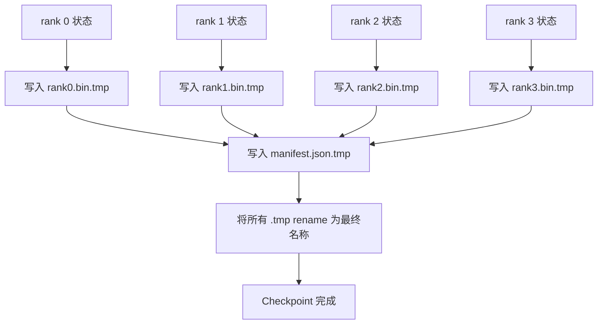

# Sharded Checkpoint 与原子恢复

> 一个具有 70B parameter 的 Training 任务每隔几小时就会因节点故障而暂停。Checkpoint 格式决定了你会损失 30 分钟还是 30 小时。Sharded Checkpoint 会并行写入每个 rank 的 shard，并在 manifest 中记录归属关系。恢复时，每个 rank 从自己的文件加载 shard，在相同 world size 下重建状态，Optimizer 随后就像什么都没有发生一样继续执行 step。原子写入可以防止未完成一半的 Checkpoint 破坏下一次恢复。

**Type:** Build
**Languages:** Python
**Prerequisites:** Phase 19 Track C 课程 42-49
**Time:** ~90 分钟

## 学习目标

- 将 multi-rank Checkpoint 保存为每个 rank 一个 shard 文件，并附加记录各项归属 rank 的 manifest。
- 使用原子写入模式（先写入临时路径，再 rename），确保写入过程中发生崩溃时绝不会产生只完成一半的 Checkpoint。
- 从 manifest 恢复，并验证每个 rank 上的 fp16 parameter 和 ZeRO Optimizer 状态都保持 byte-equal。
- 保护 manifest schema，使其能够应对三种故障模式：world-size 变化、shard 数量不匹配和部分写入。

## 问题

传统 Checkpoint 会将所有 parameter 和 Optimizer 状态读入 rank 0，执行 gather，然后写入单个文件。对于 70B Model，这意味着要通过一个 rank 的网络端口传输 1.1 TB 状态。写入会阻塞其他所有 rank，因为它们只能空闲等待 gather。IO 带宽取决于最慢的单个 GPU 网络链路，而不是聚合带宽。在真实 cluster 上，gather 后再写入的步骤可能比之前一小时的 Training 用时更长，这意味着整个任务每天 Training 期间能保存的 Checkpoint 还不到一个。

Sharded Checkpoint 将这一模式反转：每个 rank 并行将自己的 shard 写入单独文件。Manifest 记录每个 shard 由哪个 rank 持有，使恢复过程能够将每个 shard 放回原来的位置。聚合写入带宽会随 cluster 扩展。通过一个 rank 写入需要 4 小时的 1 TB Checkpoint，通过 64 个 rank 只需 4 分钟。此外，manifest 还为不兼容的恢复提供了一项契约：可以检测 world-size 变化和部分写入，加载路径可以明确失败，而不是静默使用过期数据。

## 概念



### Manifest schema

```json
{
  "world_size": 4,
  "step": 1234,
  "wall_clock_seconds": 4521,
  "shards": [
    {"rank": 0, "path": "rank0.bin", "sha256": "...", "param_shard_offset": 0, "param_shard_numel": 65536},
    {"rank": 1, "path": "rank1.bin", "sha256": "...", "param_shard_offset": 65536, "param_shard_numel": 65536}
  ],
  "schema_version": 1
}
```

其中三个字段至关重要。`world_size` 会使不同 size 下的恢复明确失败，而不是静默破坏数据。每个 shard 的 `sha256` 可以捕获部分写入或损坏的写入。每个 shard 的 `param_shard_offset` 和 `param_shard_numel` 使 loader 能够在正确位置重建扁平 parameter Tensor。

### 原子写入

标准模式是：将每个 shard 写入 `<name>.tmp`，将 manifest 写入 `manifest.json.tmp`，分别执行 fsync，然后 rename。同一 filesystem 内的 POSIX rename 是原子的；新文件要么完整存在，要么保留旧文件。在最终 rename 前发生崩溃时，之前的 Checkpoint 仍是有效版本。如果没有原子写入，崩溃可能留下部分写入的 shard，同时存在指向它的 manifest，导致恢复加载时损坏 Optimizer 状态。

### Schema 必须防御的三种故障模式

| 故障 | 症状 | 防御措施 |
|---------|---------|---------|
| World-size 变化 | 使用 N=4 的 manifest 在 N=8 上恢复 | manifest 中的 world_size 不匹配，明确失败 |
| Shard 数量不匹配 | 恢复时看到的 rank*.bin 文件少于 manifest 中的 shard | 枚举 shard，验证每一个都存在 |
| 部分写入 | shard 文件在 flush 中途被截断 | 加载时验证 sha256 |

每项防御措施都会尽早拒绝错误加载；否则就会发生静默数据损坏，直到 100 个 step 后 Loss 变成 NaN 才暴露出来。

### 为什么使用每个 rank 一个文件，而不是单个大文件

在 POSIX 上通过 `O_APPEND` 并发写入单个文件适用于 byte-aligned write，但在实践中，一个 shard 内的 offset 会跨越以 MB 计的区域，锁竞争会成为主要开销。每个 rank 使用单独文件不会产生竞争，而且当底层 filesystem 支持并行处理（Lustre、GPFS）时，还能受益于 striping。Production stack（DeepSpeed、FSDP、NeMo）都出于这一原因使用每个 rank 一个文件。

```figure
ci-sharded-checkpoint
```

## 构建它

`code/main.py` 实现：

- `ShardManifest` dataclass，包含上述 schema 以及 `to_json`/`from_json`。
- `save_sharded(state_dict_per_rank, dir, step)`，使用原子的临时文件后 rename 模式，将每个 rank 的 binary 状态写入单独文件，然后写入 manifest。
- `load_sharded(dir, expected_world_size)`，读取 manifest，验证每个 shard 的 sha256，并返回每个 rank 的 state dict。
- Round-trip 测试：构建每个 rank 的状态，保存、加载，并断言 byte-equal。

运行：

```bash
python3 code/main.py
```

输出：写入 4 个 shard 文件和 manifest，然后重新加载并完成 byte-equal 验证。

## 真实环境中的 Production 模式

以下三种模式可将 Checkpoint 强化到足以交付的程度。

**异步写入。** Production stack 会在单独的 thread 或进程上执行 Checkpoint 写入，使 Training 能够继续。Barrier 位于下一个 Checkpoint：在前一次保存完成前，不要开始下一次保存。DeepSpeed 的 `async_io` flag 正是这样做的。本课程保持同步写入，以便清楚展示各个步骤。

**先写入本地高速磁盘，再异步上传。** 先写入本地 NVMe（速度快），再异步上传到 S3 或 GCS。这种双层模式既能保留 cluster 内用于恢复的高速 Checkpoint，又能将持久副本传到 cluster 外进行归档。Manifest 保存本地路径；upload manifest 保存远程路径。

**轮换很重要。** Production 任务会保留最后 K 个 Checkpoint（通常为 3-5 个），并轮换删除最旧的版本。如果不轮换，磁盘会在任务运行过程中被填满，导致下一次 Checkpoint 保存失败。使用轮换时，下一次保存会先删除最旧版本，释放容量预算。

## 使用它

Production 模式：

- **DeepSpeed Checkpointing。** `deepspeed.save_checkpoint(tag=step)` 写入每个 rank 的文件，并写入指向 active tag 的 `latest` 文件。
- **PyTorch FSDP Checkpointing。** `torch.distributed.checkpoint` 使用 `Planner` 保存 sharded 状态，由它决定每个 rank 的布局。
- **NeMo。** 使用统一的 `save_to_checkpoint` API 封装 DeepSpeed 和 FSDP，并添加 metadata。

## 交付它

课程 81 会保存端到端 DDP+ZeRO 运行的 Sharded Checkpoint，并在相同 world size 下重新加载，以证明恢复契约成立。

## 练习

1. 添加异步写入：在 thread 中启动保存，并让 Training 继续。在前一次保存完成前阻塞下一次保存。
2. 添加 `last_5_steps` 轮换：保留最近的 5 个 Checkpoint，在保存新版本前删除最旧版本。
3. 为 inner-loop reload 添加仅使用 CRC 的快速验证路径（轮换会将一个 Checkpoint 转为新的 active 版本，而不执行完整 sha256）。
4. 添加跨 world size 加载：读取 manifest、执行拼接并重新分片，将 shard 从 N=4 重新平衡到 N=8。
5. 添加到 fake S3（第二个目录）的上传功能，并写入 upload manifest。说明双层存储策略的理由。

## 关键术语

| 术语 | 人们怎么说 | 实际含义 |
|------|----------------|------------------------|
| Sharded Checkpoint | “每个 rank 单独保存” | 每个 rank 并行写入自己的 shard 文件 |
| Manifest | “索引” | 记录 shard 路径、offset 和 sha256 的 JSON 文件 |
| Atomic write | “先写 tmp，再 rename” | 写入 .tmp 后执行 POSIX rename，使崩溃发生时之前的文件仍然有效 |
| Partial write | “截断的 shard” | 写入期间发生崩溃会产生损坏的 shard；sha256 可以检测到它 |
| Rotation | “保留最后 K 个” | 写入新 Checkpoint 前删除最旧版本，从而限制磁盘使用量 |

## 延伸阅读

- [DeepSpeed checkpointing](https://deepspeed.readthedocs.io/en/latest/model-checkpointing.html)
- [PyTorch torch.distributed.checkpoint](https://pytorch.org/docs/stable/distributed.checkpoint.html)
- [POSIX rename atomicity](https://pubs.opengroup.org/onlinepubs/9699919799/functions/rename.html)
- Phase 19 课程 78 - 此 Checkpoint 要保存的 ZeRO 状态
- Phase 19 课程 81 - 端到端 demo 对保存的状态执行 round-trip
