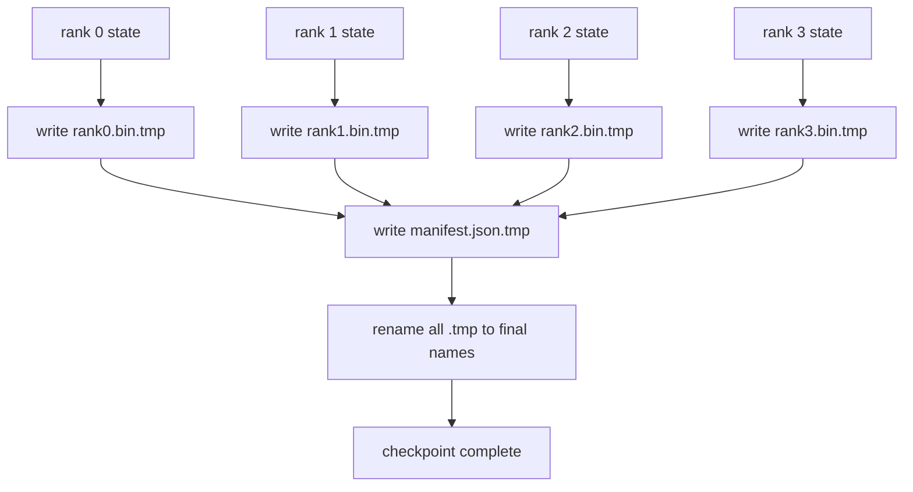

# 分片检查点和原子恢复

> 每隔几个小时就会因节点故障而暂停 70B 参数的训练作业。检查点的形式决定了你是损失 30 分钟还是 30 小时。分片检查点并行写入每个等级的分片，并在清单中记录所有权。 Resume 从其自己的文件加载每个等级的分片，在相同的世界大小上重建状态，并且优化器就像什么都没发生一样。原子写入可以防止半完成的检查点毒害下一个恢复。

**Type:** Build
**Languages:** Python
**Prerequisites:** 第 19 期 Track C 课程 42-49
**Time:** ~90 分钟

## 学习目标

- 将多等级检查点另存为每个等级的分片文件以及记录哪个等级拥有什么的清单。
- 使用原子写入模式（写入临时路径然后重命名），因此写入过程中的崩溃永远不会产生半完成的检查点。
- 从清单中恢复，验证每个等级上 fp16 参数和 ZeRO 优化器状态的字节相等状态。
- 保护清单架构免受三种故障模式的影响：全局大小更改、分片计数不匹配和部分写入。

## 问题

普通检查点将所有参数和优化器状态读取到等级 0，收集并写入单个文件。对于 70B 型号，通过一级网络端口提供 1.1 TB 状态。写入会阻塞所有其他等级，因为它们空闲等待收集。 IO 带宽是最慢的单个 GPU 网络链路，而不是聚合带宽。在真实的集群上，“收集然后写入”步骤可能需要比之前的训练时间更长的时间，这意味着每个训练日作业传送的检查点少于一个。

分片检查点翻转了模式：每个等级将自己的分片并行写入自己的文件。清单记录了哪个等级拥有哪个分片，因此恢复可以将每个分片放回其来源处。聚合写入带宽随集群扩展。 1 TB 检查点需要 4 小时完成一个级别，需要 4 分钟完成 64 个级别。另外，清单还为您提供了不兼容简历的合同：世界大小的变化是可检测的，部分写入是可检测的，并且加载路径可能会大声失败，而不是默默地使用过时的数据。

## 概念



### 清单架构

```json
{
  "world_size": 4,
  "step": 1234,
  "wall_clock_seconds": 4521,
  "shards": [
    {"rank": 0, "path": "rank0.bin", "sha256": "...", "param_shard_offset": 0, "param_shard_numel": 65536},
    {"rank": 1, "path": "rank1.bin", "sha256": "...", "param_shard_offset": 65536, "param_shard_numel": 65536}
  ],
  "schema_version": 1
}
```

三个场都是承重的。 `world_size` 使不同大小的简历大声失败，而不是默默地损坏。每个分片的 `sha256` 捕获部分或损坏的写入。每个分片的 `param_shard_offset` 和 `param_shard_numel` 让加载器在正确的位置重建平面参数张量。

### 原子写入

标准模式：将每个分片写入 `<name>.tmp`，将清单写入 `manifest.json.tmp`，fsync 每个分片，然后重命名。同一文件系统内的 POSIX 重命名是原子的；要么新文件完全存在，要么旧文件完全存在。最终重命名之前的崩溃会使前一个检查点成为活动检查点。如果没有原子写入，崩溃可能会留下一个带有指向它的当前清单的部分分片，并且负载会在恢复时破坏优化器状态。

### 模式必须防御的三种故障模式

|失败|症状|防御|
|---------|---------|---------|
|世界规模的变化|在 N=8 上恢复，并从 N=4 开始清单 |清单中的 world_size 不匹配，大声失败 |
|分片数量不匹配 |resume 看到的 rank*.bin 文件少于 manifest 中的分片 |枚举分片，验证每个分片都存在 |
|部分写入|分片文件在刷新过程中被截断|加载时进行 sha256 验证 |

每个防御都会尽早拒绝不良负载；另一种选择是静默损坏，当损失变为 NaN 时，100 步后就会出现这种损坏。

### 为什么是每个等级的文件，而不是一个大文件

通过 `O_APPEND` 对一个文件的并发写入适用于 POSIX 字节对齐写入，但实际上，一个分片内的偏移量跨越 MB 大小的区域，并且锁定占主导地位。当底层文件系统是并行的（Lustre、GPFS）时，每个等级的文件没有争用，并且可以从条带化中受益。因此，生产堆栈（DeepSpeed、FSDP、NeMo）都使用 per-rank 文件。

## 构建它

`code/main.py` 实现：

- `ShardManifest` 数据类，具有上述架构加上 `to_json`/`from_json`。
- `save_sharded(state_dict_per_rank, dir, step)` 使用原子临时然后重命名模式将每个等级的二进制状态写入其自己的文件，然后写入清单。
- `load_sharded(dir, expected_world_size)` 读取清单，验证每个分片的 sha256，并返回每个等级的状态字典。
- 往返测试：构建每列状态、保存、加载、断言字节相等。

运行它：

```bash
python3 code/main.py
```

输出：4 个分片文件以及写入的清单，然后通过字节相等验证重新加载。

## 野外生产模式

三种模式使检查点足够坚固以进行运输。

**异步写入。** 生产堆栈在单独的线程或进程上发出检查点写入，以便训练继续进行。障碍位于下一个检查点：在前一个保存完成之前不要开始下一个保存。 DeepSpeed 的 `async_io` 标志正是这样做的。本课程保持写入同步，因此步骤可见。

**先本地快速磁盘，然后异步上传。**写入本地 NVMe（快速），然后异步上传到 S3 或 GCS。两层模式使集群内检查点能够快速恢复，同时将持久副本发送到集群外进行存档。清单携带本地路径；上传清单携带远程路径。

**轮换很重要。** 生产运行保留最后 K 个检查点（通常为 3-5 个）并轮换最早的检查点。如果不旋转，磁盘会在运行中填满，并且下一个检查点会失败。通过轮换，下一次保存会先删除最旧的，从而释放预算。

## 使用它

生产模式：

- **DeepSpeed 检查点。** `deepspeed.save_checkpoint(tag=step)` 写入每个等级的文件和指向活动标签的 `latest` 文件。
- **PyTorch FSDP 检查点。** `torch.distributed.checkpoint` 使用决定每个等级布局的 `Planner` 保存分片状态。
- **NeMo.** 使用添加元数据的统一 `save_to_checkpoint` API 封装 DeepSpeed 和 FSDP。

## 发货

第 81 课保存了端到端 DDP+ZeRO 运行的分片检查点，并在相同的世界大小上重新加载它，以证明恢复契约成立。

## 练习

1. 添加异步写入：在线程中启动保存并让训练继续。阻止下一次保存，直到上一次保存完成。
2. 添加 `last_5_steps` 轮换：保留 5 个最近的检查点，删除最旧的检查点，然后保存新的检查点。
3. 为内循环重新加载添加仅 CRC 的快速验证路径（旋转将检查点滚动为新的活动检查点，无需完整的 sha256）。
4. 添加跨世界大小的负载：通过读取清单、连接和重新分片，将分片重新平衡从 N=4 到 N=8。
5. 将上传添加到假 S3（第二个目录）并编写上传清单。捍卫两层存储策略。

## 关键术语

|术语 |人们怎么说|它实际上意味着什么 |
|------|----------------|------------------------|
|分片检查点 | “按等级保存”|每个rank并行写入自己的分片文件|
|清单 | “索引”|记录分片路径、偏移量和 sha256 的 JSON 文件 |
|原子写| “tmp 然后重命名” |写入 .tmp，然后 POSIX 重命名，以便崩溃使先前的文件保持活动状态 |
|部分写入| “截断的碎片” |写入过程中的崩溃会产生损坏的分片； sha256 抓住它 |
|旋转| “保留最后 K”|在写入新检查点以限制磁盘使用量之前删除最旧的检查点 |

## 进一步阅读

- [DeepSpeed 检查点](https://www.deepspeed.ai/tutorials/checkpointing/)
- [PyTorch torch.distributed.checkpoint](https://pytorch.org/docs/stable/distributed.checkpoint.html)
- [POSIX重命名原子性](https://pubs.opengroup.org/onlinepubs/9699919799/functions/rename.html)
- 第 19 阶段第 78 课 - 此检查点旨在保存的 ZeRO 状态
- 第 19 阶段第 81 课 - 端到端演示往返保存的状态
