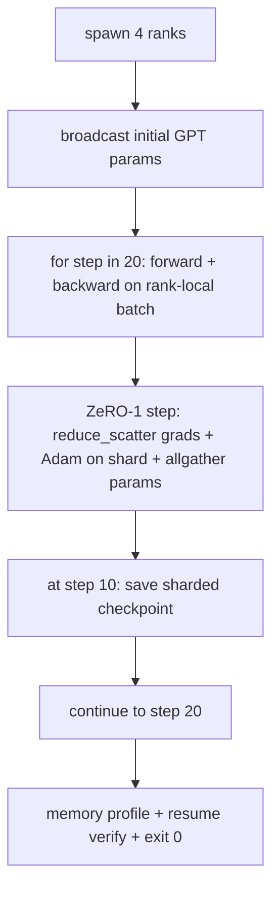

# 端到端分布式训练

> 第 76 课到第 80 课各拼凑了一件作品。这是组件：一个在 4 个模拟队列上训练的微型 GPT，使用 DDP 进行梯度同步，ZeRO-1 用于Optimizer状态分片，以及中间token处的分片检查点。该演示运行 20 个步骤，自动终止，打印损失曲线和内存配置文件，并写入可恢复检查点。

**Type:** Build
**Languages:** Python
**Prerequisites:** 第 19 期 Track C 课程 42-49
**Time:** ~90 分钟

## 学习目标

- 将 DDP（第 77 课）加上 ZeRO-1（第 78 课）加上分片检查点（第 80 课）组成一个训练循环。
- 在小型合成语料库上训练 2 层 Transformer 语言模型，跨 4 个模拟等级进行 20 个步骤。
- 打印每步丢失表、每列内存配置文件以及在相同世界大小上恢复字节相等的检查点清单。
- 捍卫作文：每首作品都可以在之前的课程中独立测试，本课证明它们是作曲的。

## 问题

Capstone是各个部分组合在一起的证据。第76课实施集体。第 77 课将它们纳入 DDP。第 78 课使用 reduce_scatter 分片Optimizer状态。第 79 课分析了管道。第 80 课保存了一个分片检查点。每节课都有自己的测试。真正的训练运行会同时使用每个原语；如果组合错误，损失会发散，检查点拒绝恢复，或者每列内存在应该收缩时却增长。

本课程运行端到端演示并验证四个不变量：(a) 损失在浮动噪声内的 20 个步骤中单调减少，(b) 每个等级在每个步骤中都保持相同的参数范数，(c) 每个等级Optimizer内存等于 ZeRO-1 公式 12P/N 字节，以及 (d) 步骤 10 处的检查点在重新启动时重新加载字节相等。演示自行终止：20 个步骤，单个命令，退出 0。

## 概念



### 迷你 GPT

该模型故意很小：2 个Transformer块、Embeddingdim 32、4 个注意力头、词汇 64、序列长度 16、批次 4。几千个参数。足够大以执行每个连线决策（多头注意力运行标准屏蔽路径；LayerNorm 有要同步的权重；LM 头是返回词汇的单独线性投影）。足够小，4 个 CPU 级别上的 20 个步骤可在几秒钟内完成。

### 组成规则

|课程片段 |它拥有什么 |它留给循环什么？
|--------------|--------------|----------------------------|
| DDP广播 |初始参数同步 |构建时一次调用 |
| ZeRO-1 步骤 |梯度同步、母版更新、参数广播 |每一步调用一次，替换 optimiser.step |
|分片检查点 |保持每等级状态，用 sha256 体现 |通过 allgather 收集状态，调用等级 0 |
|训练循环 |向前、向后、丢失记录 |按顺序调用以上三个 |

该循环不知道有关reduce_scatter 或rendezvous 文件。 ZeRO 和检查点模块公开了循环组成的狭窄接口。

### 为什么是小型 GPT 而不仅仅是 MLP

第 77 课中的 MLP 足以验证梯度同步。一个微小的 GPT 添加了三件事：词汇上的一个单独的 LM 头（在本课中，为了清晰起见，将其解开；完整的 GPT 通常将头与tokenEmbedding联系起来）、softmax+交叉熵作为损失（比 MSE 更多的数值边缘情况），以及一个不对称的前向（Embedding然后是注意力，然后是每层的 MLP）。坚持使用 MLP 作为Capstone将隐藏合成是否正确处理 LayerNorm 或Embedding层的渐变形状。

### 自终止意味着退出 0

循环运行固定的 20 步并退出。没有`while True`，没有人为干预，没有从外部状态恢复。您可以在无人值守的情况下运行并在完成后找到完整日志的Capstone是证明系统接线正确的Capstone。如果任何部分陷入僵局，演示将永远不会返回，并且测试fixture会捕获它。

```figure
ci-distributed-assembly
```

## 构建它

`code/main.py` 实现：

- `MiniGPT`：具有屏蔽自注意力和独立 LM 头的 2 层Transformer。
- `make_corpus(seed, total_tokens)`：确定性的下一个token预测数据。
- `_train_worker`：按等级生成；广播初始化参数，运行循环，调用 ZeRO 步骤，在步骤 10 写入分片检查点。
- `verify_resume`：主运行后，重新加载进程中的第 10 步检查点，并断言保存的主分片与内存中快照逐字节匹配。
- `main`：编排整个演示，打印丢失表、内存配置文件和验证结果。

运行它：

```bash
python3 code/main.py
```

输出：20 行丢失表、4 行每列内存配置文件、检查点清单以及成功时的“RESUME VERIFIED”行。

## 野外生产模式

三种模式完成了真实运行的构图。

**每 K 分钟检查一次，而不是每 K 步骤一次。** 步骤时间随 seq 长度和微批次计数而变化。无论模型大小如何，10 分钟的检查点节奏都会捕获相同的计算。为了简单起见，本课程使用基于步骤的方式；生产采用挂钟为主。

**及早检测分歧。**生产运行在向后添加 NaN 防护和丢失尖峰检测器；如果损失在一步中跳跃超过 2 倍，则回滚到前一个检查点，而不是让Optimizer进入退化状态。本课程的损失曲线很平滑，因此防护fixture未使用，但钩子保留。

**跨等级聚合内存配置文件。** 每等级内存在实际运行中因等级而异（具有最大管道阶段的等级拥有更多激活）。生产记录各等级的最大值加上平均值；本课程按等级打印以显示公式匹配。

## 使用它

生产模式：

- **DeepSpeed.** 在一个配置下结合了 DDP + ZeRO + 管道 + 激活检查点。本课程的构图是 DeepSpeed 形状的缩影。
- **PyTorch FSDP。** 本机等效项。 `FullyShardedDataParallel` 和 `ShardingStrategy.SHARD_GRAD_OP` 是 ZeRO-2。
- **NeMo 和 Megatron-LM。** 为最大的模型添加张量并行；否则，组合物的形状相同。

## 发货

完整曲目到此结束。这 6 个课程共同构成了真正的团队在采用 DeepSpeed 之前将构建的分布式训练子系统；该抽象已针对 gloo 得到了证明，并且故障模式已得到运用。第 17 阶段（基础设施和生产）是将其转变为真正的集群的地方​​。

## 练习

1. 添加注意力头的张量并行分割并验证损失与单秩基线匹配。两级：每级一半人头，注意力输出都减少。
2. 添加 4 个微批次的梯度累积，并证明梯度等于一大批次的梯度。
3. 添加一条从步骤 10 开始恢复的路径，该路径实际上继续训练到步骤 20，并产生与原始运行相同的最终损失。
4. 将指标导出（损失、梯度范数、步时间）添加到 JSONL，以便事后可以可视化运行。
5. 添加一个 NaN 防护，在丢失尖峰时回滚到前一个检查点，并使用单步 LR 乘数强制尖峰来执行回滚。

## 关键术语

|术语 |人们怎么说|它实际上意味着什么 |
|------|----------------|------------------------|
|端到端| “将一切连接起来”|一次运行构成了每个部分，而不是每个部分的单元测试 |
|内存简介 | “每级 GB”|每个等级上保存的参数、梯度、Optimizer状态的字节数 |
|简历合同 | “保存并加载”|检查点往返后每列状态字节相等 |
|自动终止 | “有界奔跑”|固定步数，完成后退出 0，循环中没有人 |

## 进一步阅读

- 【DeepSpeed端到端训练教程](https://www.deepspeed.ai/getting-started/)
- 【PyTorch FSDP进阶教程](https://pytorch.org/tutorials/intermediate/FSDP_advanced_tutorial.html)
- 【Megatron-LM训练脚本参考](https://github.com/NVIDIA/Megatron-LM)
- 第 19 阶段第 76-80 课 - 本课组成的每首曲子
- 第 17 阶段 - 将组合移动到真实集群
