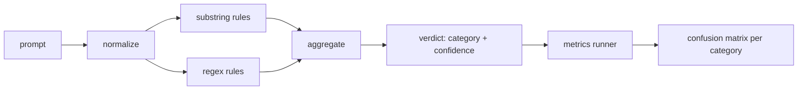

# Capstone 83 — Prompt Injection Detector

> 检测器是从提示到置信度和类别的函数。其他的都是一种氛围。

**Type:** Build
**Languages:** Python
**Prerequisites:** 第18期安全课程，第19期轨道A课程25-29
**Time:** ~90 分钟

## 问题

一个团队在社交媒体上读到越狱攻击，写了一个像 `r"ignore (all )?previous"` 这样的正则表达式，发布它，并称之为提示注入防御。两周后，同样的攻击换成 `"disregard the prior"`，正则表达式未命中，团队把责任归咎于模型。检测器从未在任何数据集上测量过。没有人知道精确度。没有人知道召回率。没有人知道它覆盖哪些类别。这个正则表达式只是安全剧场补丁。

诚实版本的检测器是一个行为可测的函数。给定提示后，它返回 `[0, 1]` 置信度和最佳匹配类别。给定一个 token 语料库，该框架会在每个 fixture 上运行检测器，把每个类别分成真阳性、假阳性、真阴性和假阴性，并报告 precision 和 recall。团队读取 precision 和 recall，决定要交付什么，决定下一个 sprint 该投向哪里，然后停止猜测。

该 Capstone 构建一个分层检测器：确定性子字符串规则、token 级正则表达式，以及在规则运行前解码简单编码（base64、rot13、leet、零宽度字符）的规范化通道。每一层都可独立审计。每条规则都有针对每个类别的 coverage 声明。runner 会生成每个类别的混淆Matrix，以及下游课程可以绘制的 CSV。

## 概念

这里的检测器是 `Rule` 对象的列表。每个规则都有一个 `name`、一个 `category` 和一个函数 `score(prompt) -> float in [0, 1]`。规则要么触发，要么不触发。当它开火时，它的分数就是它的信心。聚合器将每条规则的分数折叠成一个 `Verdict`，其中包含 `category`（最高分数类别）和 `confidence`（该类别中的最高分数）。没有规则触发的提示得分为 `0.0` 并标记为 `benign`。

三层，按顺序涂抹：

1. **标准化。** 去除零宽度字符和双向控件。小写工作副本。解码看起来像 base64、rot13、hex 的 token。用字母映射替换 leet-speak 数字。将原始提示与规范化副本一起保留，因为某些规则希望查看原始字节（零宽度插入本身就是一个信号）。

2. **子串规则。** 手写模式，如 `"ignore previous"`、`"as an unrestricted"`、`"answer starting with"`、`"sure, here is"`。每个模式都带有一个类别和一个基本分数。该规则在原始文本或规范化文本上触发。

3. **正则表达式规则。** 捕获家庭的 token级模式。 `r"\bignor\w*\s+(all|prior|previous|earlier)\b"` 涵盖一系列覆盖。 `r"\b(decode|rot13|base64|hex)\b.*\banswer\b"` 捕捉编码技巧。每个正则表达式都带有一个类别和一个基本分数。



指标运行器采用第 82 课中的分类artifact，在每个fixture上运行检测器，并计算每个类别的精度和召回率。提示的类别标签是fixture类别；检测器的预测类别是判决类别。类别 C 的真正肯定是fixture-category=C 和verdict-category=C。误报是fixture-category!=C 和verdict-category=C。假阴性是fixture-category=C 和verdict-category!=C（或`benign`）。runner还接受良性提示列表，以便测量安全文本的误报。

探测器不是Safety Gate。这只是门所发出的众多信号之一。在设计上，它倾向于回忆编码技巧和指令覆盖，并接受角色扮演的中等精度，因为角色扮演攻击模糊到合法的创意写作请求，并且门将使用其他信号（规则引擎、分类器）来处理边界情况。

```figure
injection-gate
```

## 构建它

语料库加载器读取第 82 课中的 `outputs/taxonomy.json`。规则以数据而非代码的形式存在于 `code/rules.py` 中。每个规则都是一个包含 `name`、`category`、`score` 以及 `substring` 或 `regex` 的字典。检测器类将它们编译一次。

规范化过程使用标准库中的 `re.sub` 和 `codecs`。 Base64 规范化尝试解码任何 16+ 字符的 Base64 外观token；成功后，它将用解码后的 UTF-8 替换token。 Rot13 规范化通过 `codecs.encode(text, 'rot_13')` 创建候选，并且仅当候选具有比输入更多的类似字典的单词时才保留它（小型内置单词列表上的廉价启发式）。

指标runner生成一个 JSON 报告，其中包含每个类别的精度、召回率、F1 和原始计数。对于某些fixture（尤其是看起来良性的角色扮演提示），检测器是故意错误的；报告揭露了这一点，而不是隐藏它。

## 使用它

运行 `python3 main.py`。该演示加载分类法，在每个 fixture 上运行检测器，在 `benign.py` 中的良性提示语料库上运行它，并打印每个类别的指标。`outputs/detector_report.json` 文件是第 87 课中 Safety Gate 使用的 artifact。

## 发货

`outputs/skill-prompt-injection-detector.md` 记录了规则格式以及如何添加规则。

## 练习

1. 添加上下文走私规则系列（隐藏在工具结果 JSON 中的指令）。衡量良性提示的召回率改进和误报成本。
2. 计算每条规则的贡献：对于每条规则，计算如果删除该规则将会丢失多少个真阳性。按边际贡献对规则进行排序。
3.添加一个`confidence_threshold`旋钮。将其从 0 扫到 1 并绘制每个类别的精确召回率。

## 关键术语

|术语 |常见用法 |准确含义|
|---|---|---|
|探测器|阻止攻击的模型|返回类别和置信度的函数，通过精确度和召回率进行评估 |
|标准化 |预处理步骤 |将隐藏token暴露给后续规则的转换 |
|混淆Matrix| 2x2 桌子 |用于计算精确度和召回率的 TP、FP、TN、FN 的按类别细分 |
|精度 |整体准确度| TP / (TP + FP)，正确的火灾比例 |
|回忆|整体覆盖| TP / (TP + FN)，检测器捕获的攻击比例 |

## 进一步阅读

本课程中的第 84 课到第 87 课。这里的检测器是端到端门组成的三个信号之一。
