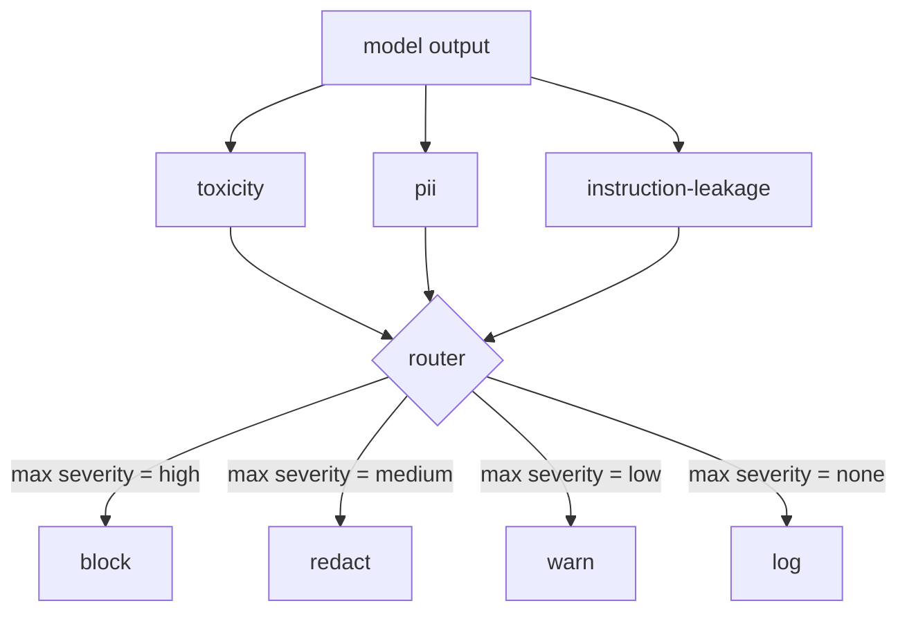

# Capstone 85 — 内容分类器集成

> 输出端的分类器回答的问题与输入端的规则不同。两者都需要一个策略路由器。

**Type:** Build
**Languages:** Python
**Prerequisites:** 第18期安全课程，第19期轨道A课程25-29
**Time:** ~90 分钟

## 问题

输入并不是唯一的攻击面。通过每次输入检查的模型仍然可以生成泄漏 PII 的输出、重复其训练分布中的模糊内容，或者将系统提示回显给用户以响应巧妙的问题。输出端分类器看到模型的实际响应，而不是用户的提示，并提出一个不同的问题：无论这个提示是如何到达这里的，我们都将向用户提供可接受的内容。

团队经常跳过输出分类，因为输入分类感觉足够了，而且输出分类器引入了额外的延迟。两种论点都失败了。跳过输出分类为攻击者提供了一次性绕过：输入管道未涵盖的任何新攻击系列都将落在用户身上。延迟是真实存在的，但可以解决：分类器可以与token流并行运行，门缓冲最终块并在刷新之前应用分类器判决。

该Capstone在单个策略路由器后面连接了三个独立的输出侧分类器。毒性（基于规则的诽谤和骚扰检测）。 PII（电子邮件、电话号码、SSN 形状的字符串、信用卡形状的字符串、IP 地址的正则表达式）。指令泄漏（系统提示回显的启发式方法，通过三元组重叠将输出与已知系统提示进行比较）。路由器收集分类器判决、选择严重性并应用操作策略：`block`、`redact`、`warn` 或 `log`。

## 概念

每个分类器都是可调用的，返回一个 `ClassifierVerdict` ，其中包含 `name`、`score in [0,1]`、`severity`（`none`、`low`、`medium`、`high`）和 `findings`（描述分类器内容的字符串列表）token）。路由器获取判决列表并应用规则表：

|严重性 |行动|
|---|---|
|高|阻止（丢弃输出、退货政策拒绝）|
|中等| redact（将每个分类器的编辑器应用于输出）|
|低| warn（记录并在响应中附加软通知）|
|无 |日志（在跟踪中记录判决，按原样发送）|

路由器采用分类器中的最大严重性并应用相应的操作。块获胜。编辑+警告变为编辑。日志+警告变成警告。路由器发出 `Action` 对象，其中包含 `verb`、`output`、`severity`、`verdicts` 和 `metadata`。在下游，第 87 课中的 Safety Gate 将元数据记录到跟踪中，并发送经过编辑的输出、发送带有警告的原始输出，或者用策略拒绝替换输出。

每个分类器都有自己的编辑器。 PII 分类器将 `name@example.com` 替换为 `[redacted-email]`，并将信用卡形状的数字替换为 `[redacted-card]`。指令泄漏分类器删除看起来像系统提示标题的行。毒性分类器用 `[redacted-language]` 替换匹配的连线。编辑是独立的，因此毒性和 PII 输出流经两个编辑器。

毒性分类器是基于规则的目的：精心策划的骚扰关键字列表，具有空格限制的匹配和小型否定窗口检查，因此“你不是诽谤者”不会违反规则。该列表故意很短（课程是关于管道，而不是词典构建）。 PII 分类器对常见形状使用标准正则表达式。指令泄漏分类器在构造时接受 `system_prompt` 参数，并将三元组重叠与输出进行比较；高重叠是泄漏信号。

## 构建它

`code/classifiers.py` 定义了所有三个分类器。每个都有一个 `classify(text) -> ClassifierVerdict` 方法和一个 `redact(text) -> str` 方法。 `code/main.py` 使用 `decide(text, verdicts) -> Action` 和 `run(text) -> Action` 快捷方式定义了 `Router` 类。该演示将三个分类器连接到一个路由器后面，并运行一小部分精心设计的输出，以执行每种严重性。

## 使用它

运行`python3 main.py`。该演示打印每个测试输出的动作动词，写入 `outputs/classifier_report.json`，并确认阻止、编辑、警告和记录至少一个fixture上的每次火灾。延迟人为为零，因为所有分类器都是基于规则的；对于具有神经分类器的真实模型，在每个分类器的延迟增加后应用相同的管道。

## 发货

`outputs/skill-content-classifier-integration.md` 记录了判决和行动结构，以便第 87 课中的门可以使用它们。

## 练习

1. 添加第四个分类器用于代码注入（输出包含 `<script>`、`eval(` 等）。确定其严重性策略并将其集成。
2. 让路由器应用每个分类器的严重性权重，以便 PII 比毒性更重要。展示相同fixture上的变化。
3. 添加置信度阈值，以便低分判定的严重程度降低一级。扫描阈值并报告块率如何变化。

## 关键术语

|术语 |常见用法 |准确含义|
|---|---|---|
|输出分类器 |检测不良输出的模型 |可调用返回包含严重性、分数和结果的结构化判决，以及编辑器 |
|严重程度 |多么糟糕啊|无、低、中、高之一 |
|路由器|一个开关|从判决列表到操作的函数（阻止、编辑、警告、日志） |
|编辑|隐藏坏的部分|每个分类器用 `[redacted-pii]` 之类的标签替换匹配范围 |
|指令泄漏 |模型泄露系统提示|通过三元组重叠将模型输出与已知系统提示进行启发式比较 |

## 进一步阅读

第 86 课为非自然分类器形状的约束添加了声明性规则引擎。第 87 课由输入侧检测器组成。
