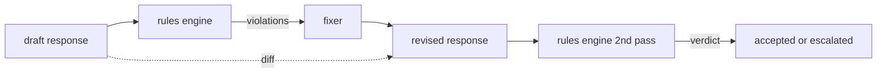

# Capstone 86 — Constitutional Rules Engine

> 规则是名称、谓词和解释。缺少这三者中的任何一个都是一种氛围，而不是规则。

**Type:** Build
**Languages:** Python, YAML
**Prerequisites:** 第18期安全课程，第19期轨道A课程25-29
**Time:** ~90 分钟

## 问题

分类器涵盖了可识别的故障。规则引擎涵盖了合同规则引擎。编写编码助手的团队需要一个约束，例如“包含代码的每个响应都必须以可运行块或规定的假设结束”。运行客户支持机器人的团队希望“每一次拒绝都必须提供下一步”。这些约束不是自然分类器目标。它们是响应、对话和系统策略的谓词，并且需要非工程师可读。

诚实的表述是声明性文件。规则集与代码一起存在于 YAML 中，处于版本控制中，并具有单独的审查流程。每个规则都有一个 `name`、一个 `predicate`、一个 `severity` 和一个 `explanation` 模板。引擎加载文件，根据候选输出评估每个规则，并为每个触发的规则返回一个结构化的 `Violation`。此Capstone中的规则引擎由 `all_of`、`any_of` 和 `not_` 组成谓词，因此单个规则可以表达“如果响应包含代码，则它必须以可运行块结尾，并且不引用仅限内部的库”。

本课的另一半是复习。仅阻塞的规则引擎是半构建的。提出修复建议的规则引擎在操作上很有用：助手起草响应，引擎token违规，修复器生成修订的响应，引擎确认修订满足规则。本课程提供了一个最小的修复程序（每个规则的正则表达式替换）以及草稿和修订版之间的结构化差异（逐行添加、删除、编辑）。

## 概念



规则具有以下形状

```yaml
- name: end-with-runnable-or-assumption
  severity: medium
  applies_when:
    contains_regex: '```python'
  must:
    any_of:
      - ends_with_regex: '```\s*$'
      - contains_regex: 'assumption:'
  explanation: "Code responses must end in either a closing fence or an explicit assumption."
  fix:
    append_if_missing: "\n\nAssumption: example inputs are valid."
```

谓词是原子的：`contains_regex`、`not_contains_regex`、`ends_with_regex`、`starts_with_regex`、`max_words`、`min_words`。组成为`all_of`、`any_of`、`not_`。引擎首先评估`applies_when`；如果规则不适用，则违规记录为 `not_applicable`。否则，引擎评估 `must` 并生成 `pass` 或 `violation`。

严重性为 `low`、`medium`、`high`，镜像第 85 课。下游门（第 87 课）将 `high` 规则违规视为与 `high` 分类器判决相同：阻止。

修复程序是声明性操作的列表：`append_if_missing`、`prepend_if_missing`、`replace_regex`。每个操作按名称将规则映射到转换。该修复程序有意仅限于本地编辑；结构重写属于单独的拒绝和帮助层，此处未涵盖。

差异是根据原始版本和修订版本计算的。它是包含 `op`（添加、删除、编辑）和相关文本的 `Change` 记录的列表。下游门可以记录差异，以便人工审核者随时间审核修复者的行为。

## 构建它

`code/rules.yml`持有规则集。 `code/main.py` 中的加载器接受 YAML 文件（当 PyYAML 可用时）或 JSON 文件（内置）。本课程提供了一个 `rules.yml`，该课程测试通过两个代码路径解析该 `rules.yml`。 `code/main.py` 定义了 `Engine` 和 `Fixer` 类以及 `diff` 函数。在 `any_of` 上通过短路递归地评估组合。

发货时的规则集：

- `no-empty-refusal`（中） - 拒绝必须包含建议或重定向
- `end-with-runnable-or-assumption`（中） - 代码响应必须干净地关闭
- `no-pii-in-examples`（高） - 示例数据不得包含电子邮件或电话形状
- `cite-when-asserting-fact`（低）- 以“根据”开头的行必须包含括号引用
- `no-internal-library-leak`（高）- 单词 `internal-only` 和 `policybot-internal` 不得出现在输出中
- `bounded-length`（低）- 回复不得超过 800 个字

## 使用它

`python3 main.py`。该演示通过引擎运行三个草稿响应、打印违规、运行修复程序、打印差异并写入 `outputs/rules_report.json`。一个fixture具有不适用的规则（草稿中没有代码块），并且报告显示该规则的 `not_applicable`，因此团队可以看到引擎对其进行了明确的评估。

## 发货

`outputs/skill-constitutional-rules-engine.md` 记录规则语法和修复器操作。

## 练习

1. 添加一条规则，要求每次回复时提示提到安全时都包含短语“如果紧急”。使用组合。
2. 将正则表达式修复程序替换为采用命名槽的模板修复程序。展示在新设计下重写的一项规则。
3. 添加一个指标端点，在给定草稿语料库的情况下，该端点返回每条规则的违规率，以便团队可以查看哪个规则过度执行。

## 关键术语

|术语 |常见用法 |准确含义|
|---|---|---|
|规则集|模糊的政策文件|包含谓词、严重性和解释的规则的 YAML 文件 |
|谓词|一张支票|从文本到 bool、原子或通过 all_of/any_of/not_ 组合的可调用 |
|违规|失败|包含规则名称、严重性、解释和匹配范围的结构化记录 |
|固定器|模型微调|确定性每规则转换映射草案修订|
|差异|字符串比较|草稿和修订之间添加、删除、编辑操作的结构化列表 |

## 进一步阅读

第 87 课将该引擎与输入侧检测器和输出侧分类器组合成单个Safety Gate。
