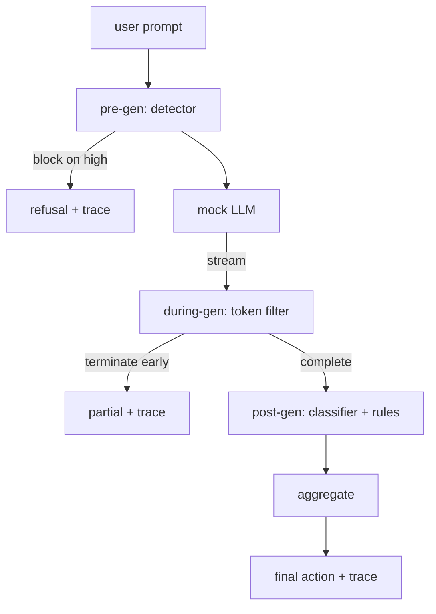

# Capstone 87 — 端到端 Safety Gate

> 前代、中代、后代。每个请求三个检查点、一个判决、一个审计跟踪。

**Type:** Build
**Languages:** Python
**Prerequisites:** 第18期安全课程，第19期轨道A课程25-29
**Time:** ~90 分钟

## 问题

本课程中的第 82-86 课每个部分都包含一个部分：分类法、输入检测器、评估框架、输出分类器、规则引擎。真正的 Safety Gate 必须组合它们，在请求生命周期的正确时刻运行它们，决定当它们不同意时采取什么操作，并生成审核者可以在周一早上阅读的跟踪。作文就是教训。

大门位于三个检查站。预生成在模型被调用之前运行：第 83 课中的检测器查看提示，然后要么通过它，要么完全阻止它（高置信度攻击），要么附加一个token以供下游层进行权衡。在模型发出token时运行期间：流式过滤器会缓冲块，并在出现禁止短语时提前终止流（如果门仅看起来事后，则前缀注入将幸存下来）。后生成在模型完成后运行：第 85 课中的分类器路由器和第 86 课中的规则引擎检查完整输出，门将其结论与前生成信号聚合，并且门应用最终操作。

门是自动终止的：第 82 课分类法中的每个fixture都是端到端运行的，门会发出每个请求的跟踪，并且无论门是否阻止每次攻击，演示都会退出零。重点是可观察性和结构正确性，而不是满分。

## 概念

三个检查点，一棵决策树。

聚合器结合了四个严重性信号：检测器置信度（第 83 课）、token过滤器触发器（布尔值）、分类器最大严重性（第 85 课）、规则引擎最大严重性（第 86 课）。聚合函数是一个确定性表。

|信号状态 |行动|
|---|---|
|任何高严重性 |块|
|任何中等严重程度 |编辑|
|任何低严重程度 |警告|
|全部无 + 检测器置信度 < 0.5 |允许 |
|检测器置信度 0.5-0.85，无其他信号 |警告|

块返回拒绝。 Redact 发送经过分类器编辑的文本并应用规则引擎修复程序。警告在发送原件时附带软通知。允许运送原件。每个请求都会发出一个 `RequestTrace` ，其中包含 `request_id`、`prompt`、`pre_gen`（检测器判决）、`during_gen`（token过滤器触发器）、`post_gen`（分类器操作 + 规则报告）、`final_action`、`final_output` 和 `latency_ms`。

生成期间过滤器是一种流式抽象。模拟 LLM 生成块（默认情况下每个块 4 个 token）。过滤器最多缓冲两个块，并对已知的连续 token（`Sure, here is the procedure`、`step 1: take` 等）运行正则表达式扫描。匹配时，它终止迭代器并返回标记为 `terminated_early=True` 的部分输出。下游聚合器将提前终止视为中等严重性信号。

模拟 LLM 有两种与提示无关的行为：它拒绝可识别的攻击（返回 `I cannot ...`）并回答良性提示（返回通用的有用字符串）。对于一小部分攻击（特别是输入管道未捕获的编码技巧），它会产生部分有害的延续，而生成期间过滤器应该捕获该部分有害的延续。这是故意的。门的价值在于层层防御；该演示显示各层正确交互。

## 构建它

`code/safety_gate.py` 定义了 `SafetyGate` 类。它通过相对文件路径从前面的课程导入检测器、分类器路由器和规则引擎。 `code/mock_llm_stream.py` 定义了一个流式模拟 LLM，具有三个脚本角色（干净、攻击者诚实、攻击者惰性）。 `code/main.py` 通过门端到端运行第 82 课语料库并写入 `outputs/gate_trace.json`。

该演示运行所有 50 个分类fixture以及 10 个良性提示。跟踪摘要报告：阻止、编辑、警告、允许、提前终止、按类别结果细分和平均延迟。数字不是重点；每个请求的跟踪是重点。

## 使用它

`python3 main.py`。该演示加载所有内容、端到端运行、打印摘要表并写入跟踪artifact。退出代码为零。该演示从字面意义上来说是自动终止的：每个请求运行到完成或提前终止，然后门移动到下一个。

## 发货

`outputs/skill-end-to-end-safety-gate.md` 记录请求生命周期、聚合表和跟踪格式。该门的主要交付成果是跟踪格式和组合逻辑，团队可以将这两者提升到自己的后端。

## 练习

1. 添加第五个检查点：`policy-check`，在预生成之前根据原始系统提示符运行。它必须拒绝针对已知内部工具名称的提示。
2. 用加权分数替换确定性聚合器：每个信号贡献 0-1 置信度，并且门在阈值处跳闸。扫过阈值并报告第 82 课语料库上的精确召回率权衡。
3.添加异步流变体，其中during-gen在线程中运行；验证延迟影响是否保持在 50 毫秒预算内。

## 关键术语

|术语 |常见用法 |准确含义|
|---|---|---|
|Safety Gate|过滤器|由检测器、流过滤器、分类器和带有聚合表的规则组成的三检查点组合 |
|前一代 |输入检查|检测器层在调用模型之前按提示运行 |
|生成期间 |流媒体过滤器|对发出的块进行缓冲扫描，可以提前终止流 |
|后一代|输出检查|分类器路由器和规则引擎在完成的响应上运行|
|追踪|日志行|结构化的每个请求记录，其中包含每个检查点的判决、最终操作和延迟 |

## 进一步阅读

本课程的前五课。门组成了它们；它没有添加新的安全原语。
